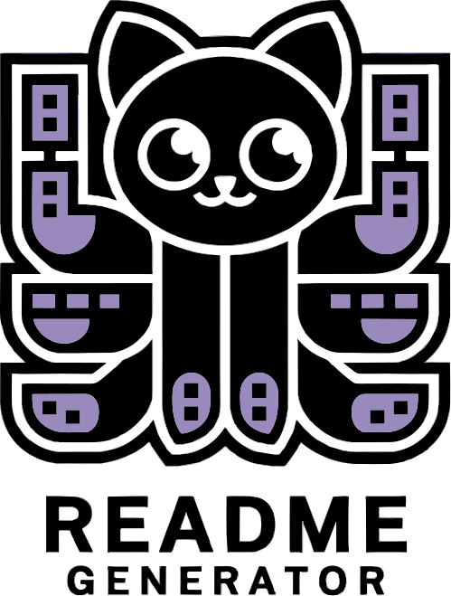

<div align="center">
 <h1><br/>GitHub Profile README Generator</h1>
 <p>Create stunning GitHub profile READMEs with an interactive visual editor!</p>

 
 
 
 
</div>

<br/>

[](https://huggingface.co/spaces/ChanMeng666/readme-profile-generator)

<br/>

https://github.com/user-attachments/assets/50189ab6-1e69-46e6-9a81-0e8649e1312f


https://github.com/user-attachments/assets/80a21331-c8ca-48d4-9e6f-17292cf84c5b


# ⭐ Features
Create your perfect GitHub Profile README in minutes! Our visual editor makes it easy to craft a professional and eye-catching profile that stands out.

### 🎯 Real-Time Preview
See your changes instantly! No more switching between editing and previewing. What you see is exactly what you'll get on your profile.

### 📊 GitHub Stats Integration 
Show off your GitHub achievements with integrated stats, most used languages, and contribution streaks. Let your work speak for itself!

### 🎨 Dynamic Project Showcase
Highlight your best work in style. Add project images, links, and descriptions in a beautiful grid layout that catches attention.

### 💻 Tech Stack Badges
Choose from hundreds of technology badges to showcase your skills. From programming languages to tools, display your expertise with sleek, auto-generated badges.

### 🔄 Daily Routine Display
Add a personal touch by sharing your daily developer routine in an animated cycle. Show visitors what drives your coding journey!

### 🌐 Social Links Integration
Connect with your audience across platforms. Easily add links to your portfolio, LinkedIn, and other social profiles with eye-catching badges.

### ⚡ One-Click Copy
Done customizing? Just click to copy your perfectly formatted README code. No manual formatting needed!

## 🛠️ Tech Stack


## 🚀 Quick Start

```bash
# Clone the repository
git clone https://github.com/ChanMeng666/readme-profile-generator.git

# Install dependencies
pip install -r requirements.txt

# Run the application
streamlit run app.py
```

## 💡 Usage
1. Open the app in your browser
2. Fill in your profile information
3. Customize your projects and skills
4. Preview in real-time
5. Copy the generated README
6. Paste into your GitHub profile repository

<details>
<summary>
  🔧 Development Setup
</summary>

### Prerequisites
- Python 3.7+
- pip

### Local Development
1. Create a virtual environment:
```bash
python -m venv venv
source venv/bin/activate  # On Windows use: venv\Scripts\activate
```

2. Install development dependencies:
```bash
pip install -r requirements-dev.txt
```

3. Start the development server:
```bash
streamlit run app.py
```

</details>

## 🤝 Contributing
Contributions are what make the open source community amazing! Any contributions you make are **greatly appreciated**.

1. Fork the Project
2. Create your Feature Branch (`git checkout -b feature/AmazingFeature`)
3. Commit your Changes (`git commit -m 'Add some AmazingFeature'`)
4. Push to the Branch (`git push origin feature/AmazingFeature`)
5. Open a Pull Request

## 📝 License
Distributed under the MIT License. See `LICENSE` for more information.

## 🙋‍♀ Author

Created and maintained by [Chan Meng](https://chanmeng.live/).
[](https://github.com/ChanMeng666)
[](https://www.linkedin.com/in/chanmeng666/)

---

<div align="center">
Made with ❤️ for the GitHub community
</div>
